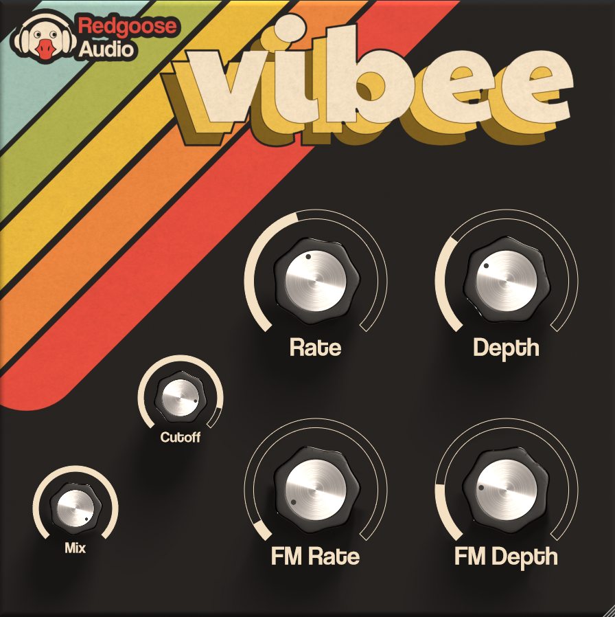

# Vibee

Vibee is a very simple but versatile open-source vibrato and FM plug-in 🌊 

Here here are some audio examples:

Electric piano - **Dry**

https://github.com/user-attachments/assets/9698193d-81e7-4f0e-a1cb-a6777a513bd8

Electric piano - **Out of tune**

https://github.com/user-attachments/assets/e93975fa-e7b8-45e3-b1a5-c76e592ca675

Electric piano - **Chorus-y**

https://github.com/user-attachments/assets/418d20e6-b05c-4fa2-9fe9-2f625fe9a137

Sub bass - **Dry**

https://github.com/user-attachments/assets/50a87c60-cbba-426e-85cd-8d1355ab9629

Sub bass - **Vibrato**

https://github.com/user-attachments/assets/46c27565-3be4-489d-ad77-905340c305b4

Techno loop - **Dry**

https://github.com/user-attachments/assets/8746bba5-8cda-4cb5-a7cc-2b0837af5716

Techno loop - **Dirty**

https://github.com/user-attachments/assets/18bd5e10-fcb7-4a2b-ab16-44c1348ff817

---

## Installation

- **Windows**: unzip and move the folder `Vibee.vst3` into your VST3 folder. On Windows, `that is usually C:\Program Files\Common Files\VST3`
- **MacOS (AU)**: copy `Vibee.component` into `/Library/Audio/Plug-Ins/Components`
- **MacOs (VST3)** copy `Vibee.vst3` into `/Library/Audio/Plug-Ins/VST3`
- **Linux** unzip a move the folder 'Vibee.vst3` into your default VST3 directory

---

## License

`vibee` is [GPLv3 licensed](https://github.com/glafiro/vibee/blob/main/LICENSE).
